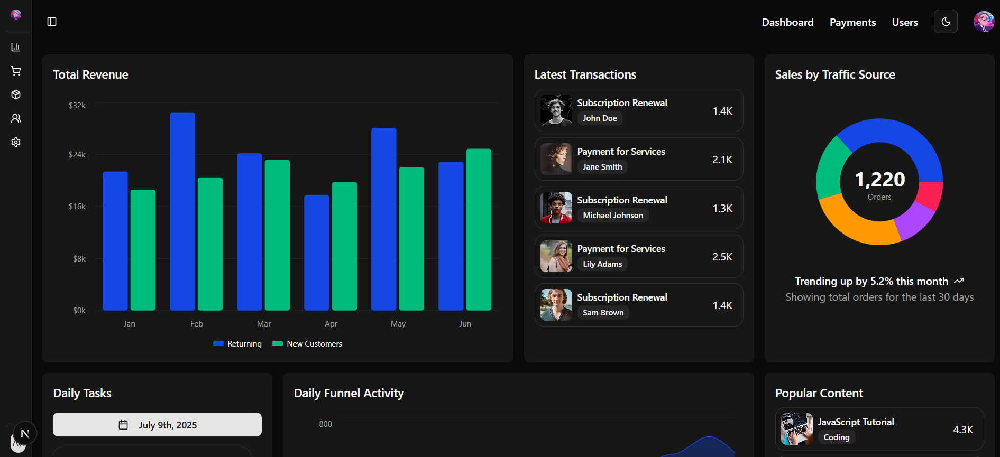
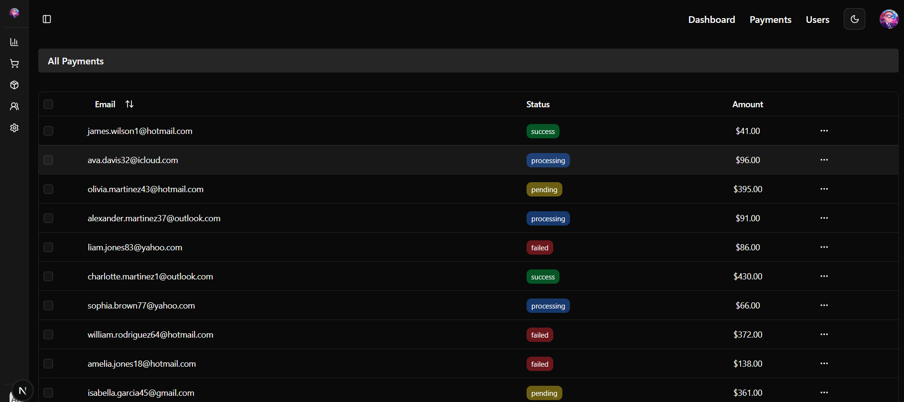
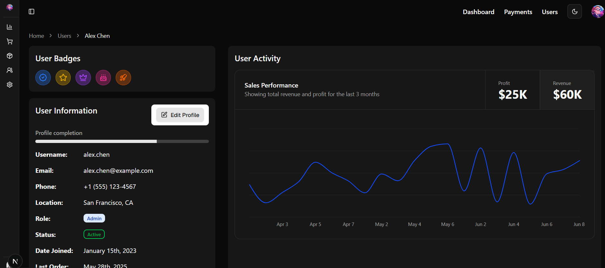

# ShadCN UI Dashboard

## Overview

This project is a comprehensive guide and implementation for building a modern, responsive dashboard using **ShadCN UI**, **Radix UI**, **Next.js**, and **Tailwind CSS**. It covers everything from setting up your development environment to designing complex UI components, handling data visualization, and implementing advanced features like data tables with Tanstack React Table.

Whether you're looking to learn how to integrate ShadCN UI into your Next.js projects or need a robust starting point for your next dashboard, this repository has you covered.

## Features

- **ShadCN UI Integration**  
  Learn how to effectively use and customize ShadCN UI components.

- **Next.js Dashboard Design**  
  A practical example of building a full-fledged dashboard layout.

- **Responsive Navbar & Sidebar**  
  Implement dynamic navigation with collapsing sidebars and nested menus.

- **Custom Theming**  
  Apply custom themes and styles to ShadCN components.

- **Data Visualization**  
  Integrate charts (Area, Pie, Line) using **Recharts** for insightful data representation.

- **Advanced Data Tables**  
  Use **Tanstack React Table** with pagination, sorting, row selection, and custom cells.

- **Form Handling & Validation**  
  Build robust forms with validation using **Zod** and **React Hook Form**.

- **Dark Mode Toggle**  
  Seamlessly switch between light and dark themes.

- **Comprehensive Component Examples**  
  Includes Dropdowns, Cards, Scroll Areas, Checkboxes, Calendars, Popovers, Breadcrumbs, Hover Cards, Progress Bars, Sheets, and more.

- **Accessibility Best Practices**  
  Concepts like `sr-only` and `asChild` for improved accessibility.

## Technologies Used

- **Next.js** – React framework for production apps  
- **ShadCN UI** – Re-usable components built with Radix UI and Tailwind CSS  
- **Radix UI** – Low-level UI primitives  
- **Tailwind CSS** – Utility-first CSS framework  
- **Recharts** – Composable charting library  
- **Tanstack React Table** – Headless UI for advanced data tables  
- **Zod** – TypeScript-first schema validation  
- **React Hook Form** – Performant and flexible form library

